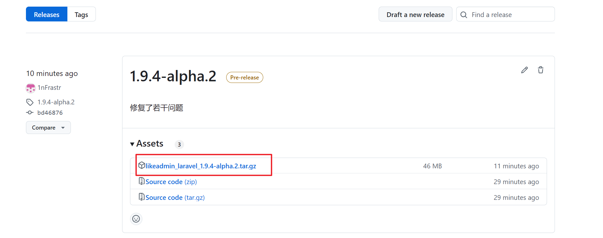
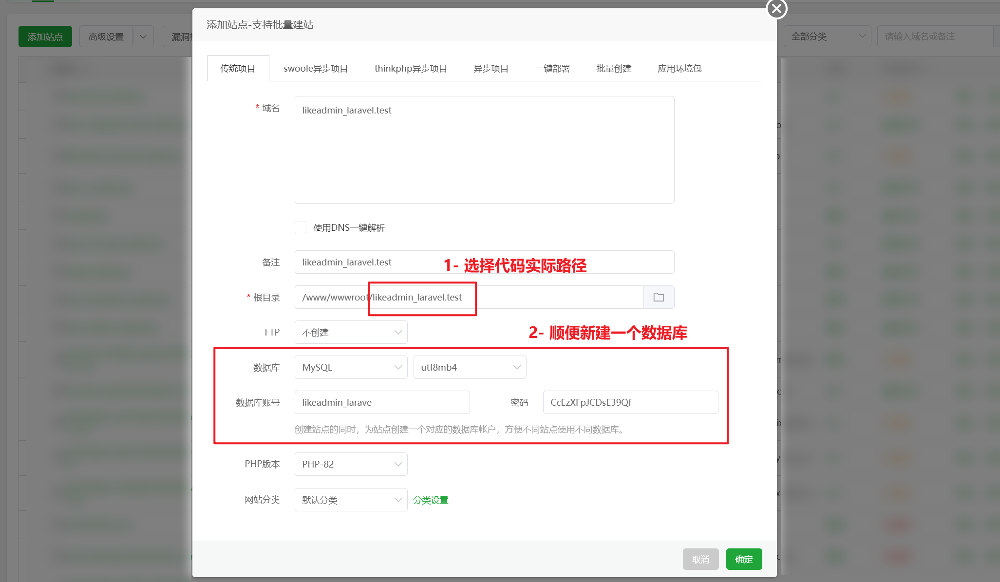
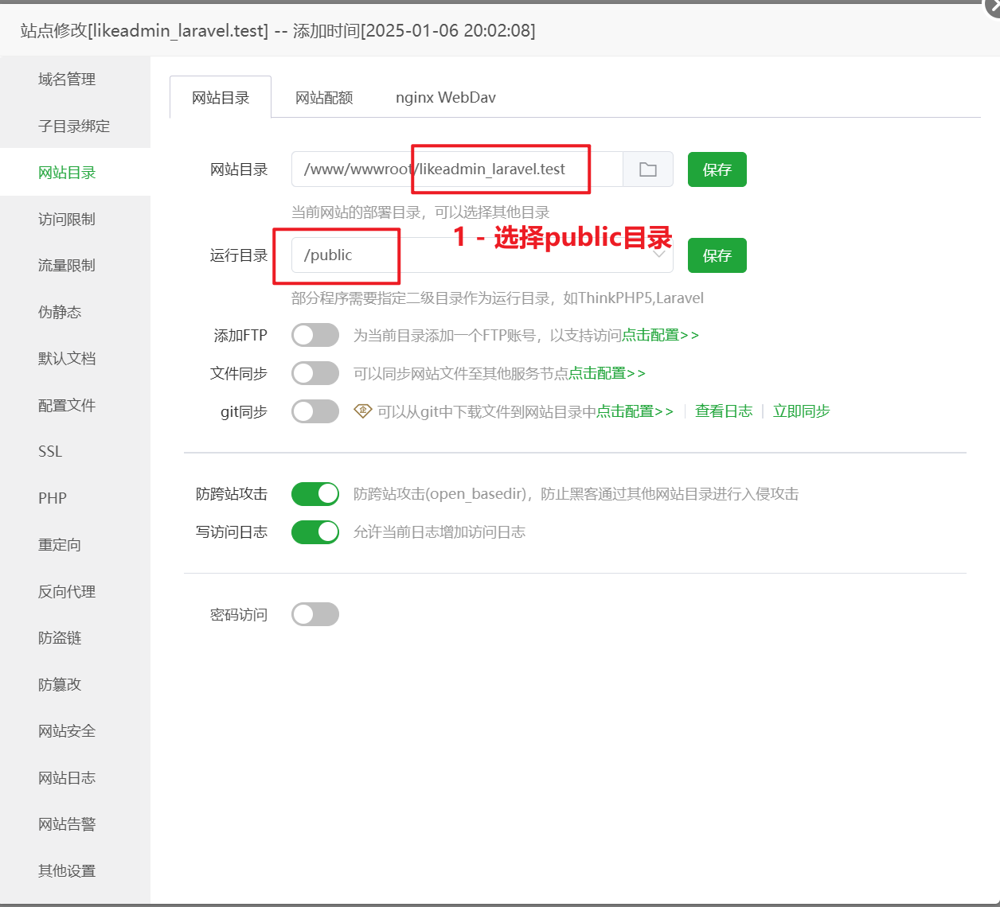
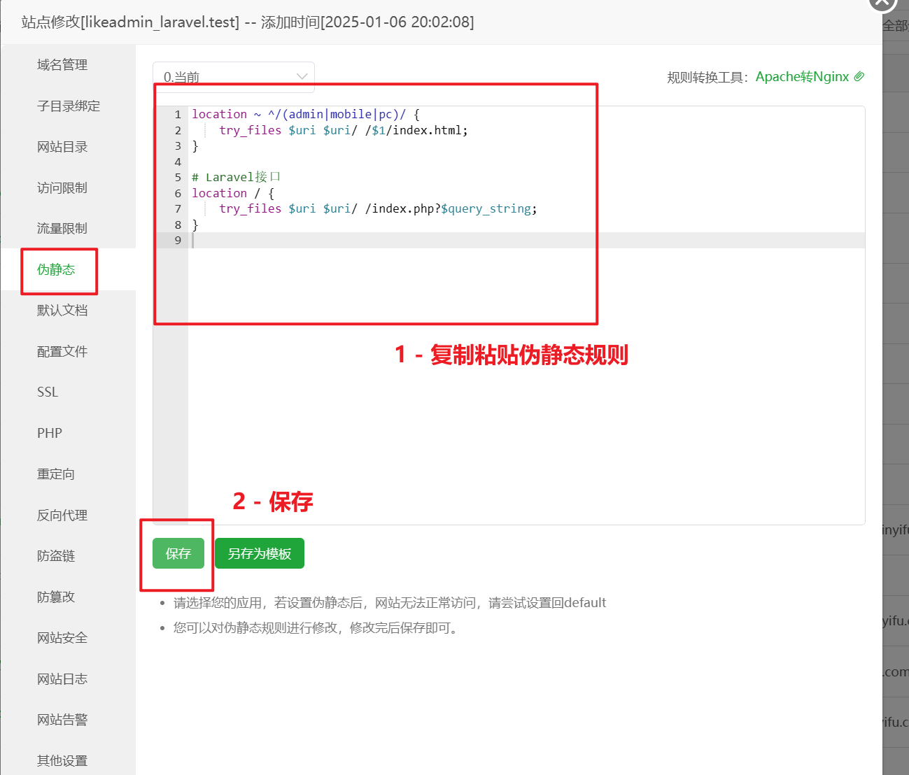
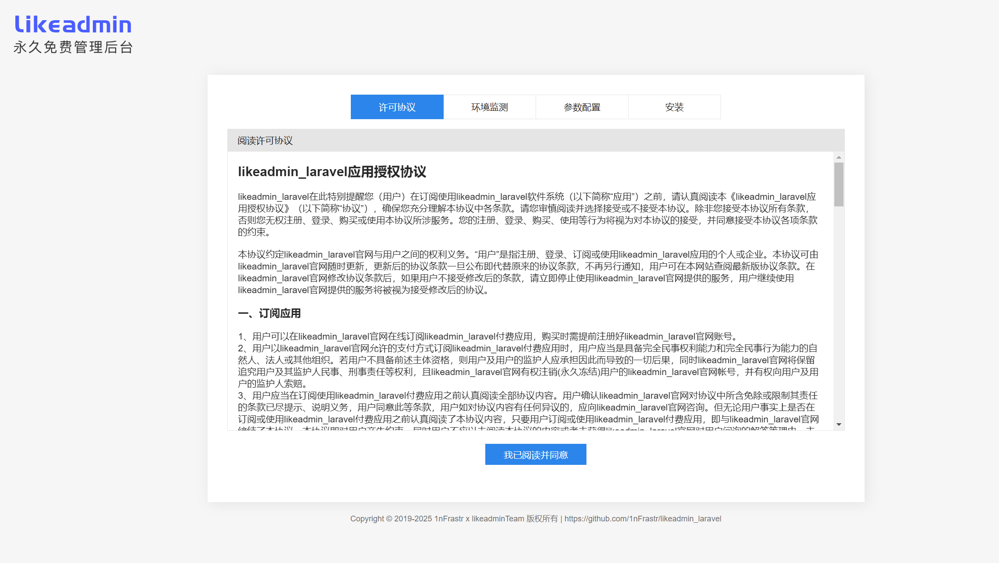
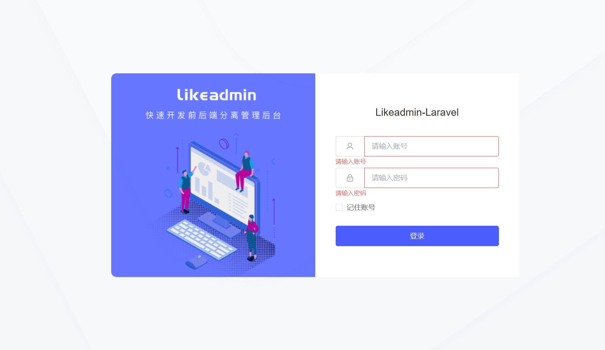
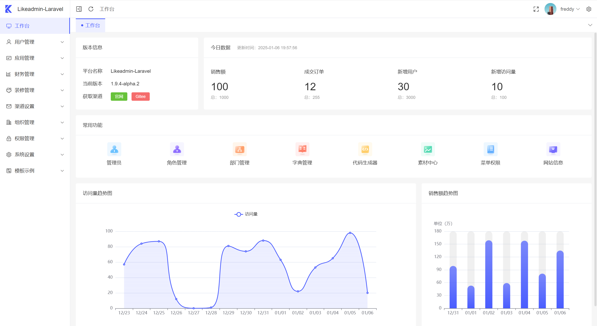

# Likeadmin-Laravel部署文档

## 1. 环境要求

- PHP 8.2
- MySQL 8.0
- Nginx服务器
- Redis缓存

下面以宝塔面板为例，介绍如何部署完整的前后端项目。

## 2. 安装基础环境

宝塔软件商店，找到PHP8.2、MySQL8.0、Redis、Nginx等软件，下载安装

**配置PHP**：需要安装以下扩展：

- fileinfo扩展
- redis扩展

## 3. 下载项目代码

到项目 [Release页面](https://github.com/1nFrastr/likeadmin_laravel/releases) 下载最新安装包，上传到您的服务器，解压到指定目录如 `/www/wwwroot/likeadmin_laravel`



## 4. 配置Nginx

1. 网站域名创建（确保域名已经解析到服务器IP地址）

    
   
2. 网站目录设置：网站目录按实际选择本项目代码在服务器上的绝对路径，运行目录选择`public`

   
   
3. 配置伪静态规则

   

 ```
# 静态文件路由
location ~ ^/(admin|mobile|pc)/ {
    try_files $uri $uri/ /$1/index.html;
}

# Laravel接口
location / {
    try_files $uri $uri/ /index.php?$query_string;
}
```

4. 配置HTTPS协议证书【可选，但强烈推荐使用免费SSL证书】
5. 访问域名网址，如果配置没问题会进入Likeadmin-Laravel的安装引导页面
 
    

## 5. 安装项目

安装引导页面会引导你完成以下操作：

- 检查服器环境、PHP环境
- 配置数据库连接
- 配置Redis缓存连接
- 配置后台管理员账号
- 自动导入数据库文件
- 完成安装

如果一切正常，可以跟随指引跳转到后台登录页面。账号密码是刚才在安装引导页面设置的管理员账号。



登录成功后，进入管理后台页面：



## 6. 其他问题

管理后台下载导出表格文件报错？尝试以下方法解决：

- 移除PHP禁用函数symlink。然后执行命令：`php artisan storage:link`

该命令创建了一个软链接到由public/storage指向storage/app/public目录，使后者目录下的文件可以通过HTTP访问。

### 联系方式

<table>
<tr>
    <td>
        
    </td>
</tr>
</table>
